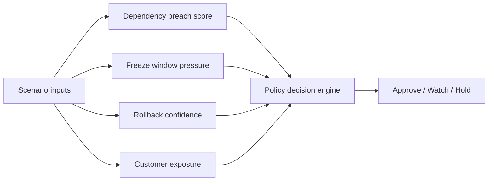
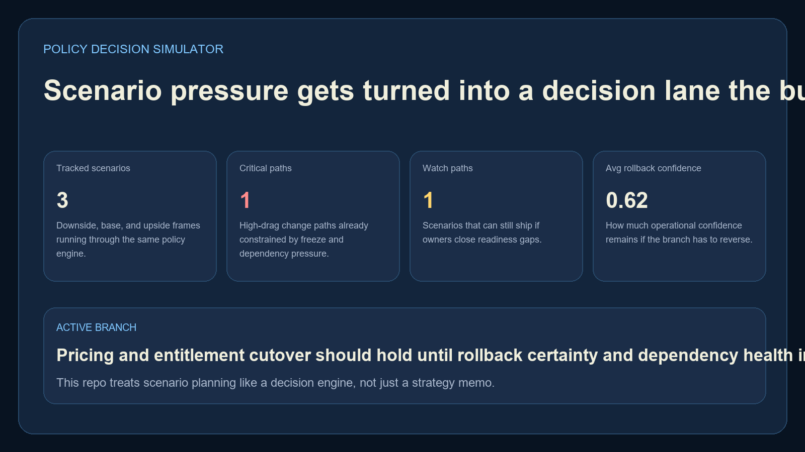
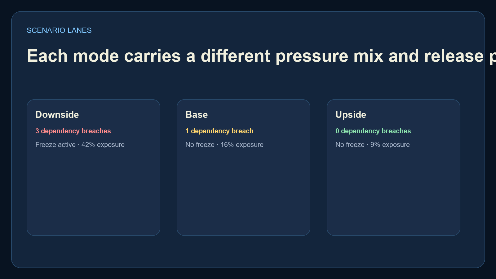
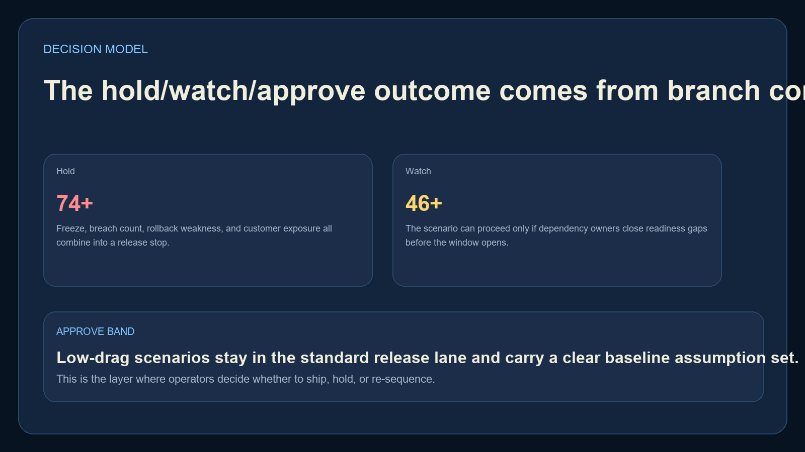
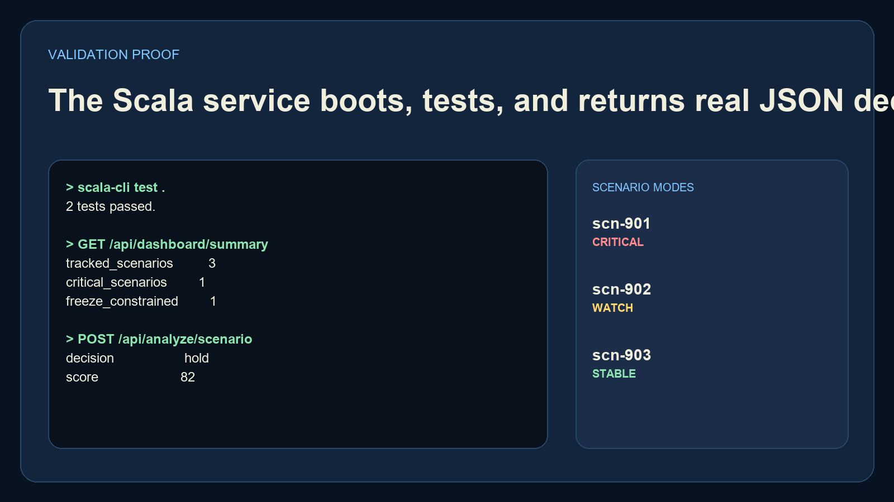

# Policy Decision Simulator

`policy-decision-simulator` is a Scala decision engine for modeling release, governance, and reliability scenarios as `hold`, `watch`, or `approve` outcomes. It runs with Scala CLI and an embedded HTTP server, so there is no SBT or framework setup required to inspect the repo.

## Executive Summary

This project turns scenario planning into a runnable service:

- downside, base, and upside scenario lanes
- dependency breach pressure
- freeze-window constraints
- rollback confidence
- customer exposure scoring
- operator-facing decision output

## Portfolio Takeaway

This repo adds a real Scala artifact to the portfolio without hiding behind boilerplate. It shows JVM breadth and decision-engine thinking in a more unusual stack.

## Overview

| Path | Purpose |
| --- | --- |
| `src/PolicyDecisionSimulator.scala` | Embedded HTTP server and routes |
| `src/PolicyDecisionEngine.scala` | Scenario scoring logic |
| `src/SampleScenarioData.scala` | Seeded strategy cases |
| `tests/PolicyDecisionSimulatorTest.scala` | Scala test coverage |
| `scripts/` | API smoke checks and PNG proof rendering |
| `screenshots/` | Real proof assets |

## API Surface

- `GET /`
- `GET /docs`
- `GET /api/dashboard/summary`
- `GET /api/sample`
- `GET /api/scenarios/{scenarioId}`
- `POST /api/analyze/scenario`

## Decision Flow



## Screenshots

### Hero


### Scenario Lanes


### Decision Model


### Validation Proof


## Run Locally

```powershell
Set-Location "C:\Users\chaus\dev\repos\policy-decision-simulator"
$env:JAVA_HOME = "C:\Program Files\Microsoft\jdk-21.0.11.10-hotspot"
$env:Path = "$env:JAVA_HOME\bin;C:\Users\chaus\AppData\Local\Microsoft\WinGet\Links;$env:Path"
scala-cli run src
```

Then open:

- `http://127.0.0.1:4514/`
- `http://127.0.0.1:4514/docs`

If the port is occupied:

```powershell
$env:PORT = "4520"
scala-cli run src
```

## Validate

```powershell
$env:JAVA_HOME = "C:\Program Files\Microsoft\jdk-21.0.11.10-hotspot"
$env:Path = "$env:JAVA_HOME\bin;C:\Users\chaus\AppData\Local\Microsoft\WinGet\Links;$env:Path"
scala-cli test .
py -3.11 -m pip install -r requirements-dev.txt
py -3.11 scripts\smoke_check.py
py -3.11 scripts\render_readme_assets.py
```

## Tech Stack

- `Scala 3`
- `Scala CLI`
- `ujson`
- `Java HttpServer`
- `Python`
- `Pillow`

## Links

- Website: [https://kineticgain.com/](https://kineticgain.com/)
- Skills Page: [https://mizcausevic.com/skills/](https://mizcausevic.com/skills/)
- GitHub: [https://github.com/mizcausevic-dev](https://github.com/mizcausevic-dev)

---

**Connect:** [LinkedIn](https://www.linkedin.com/in/mirzacausevic/) · [Kinetic Gain](https://kineticgain.com) · [Medium](https://medium.com/@mizcausevic/) · [Skills](https://mizcausevic.com/skills/)
